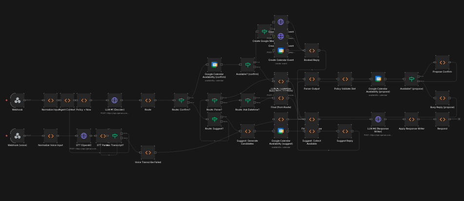

# n8n booking agent (workflow-first)

This repo is primarily an **n8n workflow** that runs a booking agent on top of Google Calendar + OpenAI:
- Text webhook: `POST /webhook/agent-chat-confirm`
- Voice webhook: `POST /webhook/agent-chat-confirm-voice` (OpenAI speech-to-text → same flow)

A small Vue frontend is included **only as an example UI**.

## Workflow

Workflow file in this repo:
- `Voice-Lead-Agent.confirm.json` (Decider + Datetime Parser + Response Writer, confirmation step, Google Calendar availability checks + booking, optional slot suggestions, Google Meet link)

Workflow overview:



n8n “test” vs “production” webhooks:
- `/webhook-test/...` works only after you click **Execute workflow** in the editor.
- Use `/webhook/...` + **activate** the workflow for stable URLs.

What the workflow does:
- Checks availability via **Google Calendar** before proposing or booking a slot
- Can **suggest free time slots** (based on your configured working hours)
- Books the event and can attach a **Google Meet** link
- Sends a **Google Calendar invitation email** to attendees (if an attendee email is collected/configured)

## Quickstart (local)

1. Copy env file:
   - `cp .env.example .env`
2. Start services:
   - `docker compose up -d --build`
3. Open n8n:
   - `http://localhost:5678`
4. Import/apply the workflow (pick one):
   - Recommended: `bash scripts/sync-agent-context.sh`
   - Manual: import `Voice-Lead-Agent.confirm.json` via the n8n UI
5. In n8n, create/select credentials and assign them to the workflow nodes:
   - **OpenAI** (Credentials → OpenAI) for the `LLM ...` and `STT (OpenAI)` HTTP nodes
   - **Google Calendar** for the calendar availability + create-event nodes
   - After importing, you typically need to open these nodes once to select credentials (imported credential IDs won’t match your instance).
6. Activate the workflow.

## Calling the agent

Text webhook:
- `POST http://localhost:5678/webhook/agent-chat-confirm`

Example payload:

```json
{ "text": "Book next Wednesday 11:45", "sessionId": "session_123", "state": null, "context": {} }
```

Voice webhook:
- `POST http://localhost:5678/webhook/agent-chat-confirm-voice`

Payload fields:
- `audio_base64`, `mimeType`, `fileName`, `sessionId`, `state`, `context`

## Agent context

Edit `context.txt`, then run:
- `bash scripts/sync-agent-context.sh`

This syncs `context.txt` into the workflow node `Agent Context` and reapplies the workflow to the local n8n container.

## Configuration

`.env` is mounted into the n8n container (`env_file: .env`). After changing `.env`:
- `docker compose up -d --force-recreate n8n`

Booking policy env vars (see `.env.example`):
- `AGENT_TZ`, `AGENT_WORKDAYS`, `AGENT_WORK_START`, `AGENT_WORK_END`
- `AGENT_HORIZON_DAYS`, `AGENT_MIN_LEAD_HOURS`
- `REQUIRE_INPUT` / `OPTIONAL_INPUT` (any mix of `email,name,phone,note`)
- `CREATE_GOOGLE_MEET`
- `AGENT_STT_MODEL`

Note: `$env` access in workflow nodes is enabled via `N8N_BLOCK_ENV_ACCESS_IN_NODE=false` for local dev.

## Frontend (example UI)

Optional demo UI:
- `http://localhost:8080`

It simply calls the n8n webhooks above. Replace it with any client.
